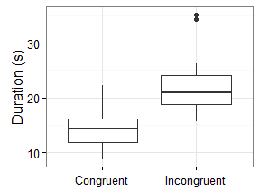
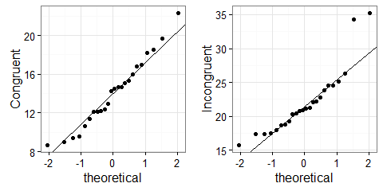

# Stroop Effect
Emilio Gozo  
August 3, 2016  

## Background Information

In a Stroop task, participants are presented with a list of words, with each word displayed in a color of ink. The participant's task is to say out loud the color of the ink in which the word is printed. The task has two conditions: a congruent words condition, and an incongruent words condition. In the congruent words condition, the words being displayed are color words whose names match the colors in which they are printed. In the incongruent words condition, the words displayed are color words whose names do not match the colors in which they are printed. In each case, we measure the time it takes to name the ink colors in equally-sized lists. Each participant will go through and record a time from each condition.

## Dataset
In this experiment, the color of the printed words is the independent variable specifically, if it matches what the word says or not. The time it took the participant to say the color is the dependent variable.

The [dataset](https://www.google.com/url?q=https://drive.google.com/file/d/0B9Yf01UaIbUgQXpYb2NhZ29yX1U/view?usp%3Dsharing&sa=D&ust=1470121605931000&usg=AFQjCNGXGWmDkxvFjhd4PGaEq_Txhec2lw) contains results from *24* participants in the task. Each row of the dataset contains the performance for one participant, with the first number their results on the congruent task and the second number their performance on the incongruent task.

**Table. 1 Summary Statistics**

task             mean      sd
------------  -------  ------
Congruent      14.051   3.559
Incongruent    22.016   4.797

We can infer from Tab. 1 that on the average, participants took longer time to finish the incongruent task than the congruent task. This is illustrated more clearly by Fig. 1, note that the inter-quartile range (IQR) of the two datasets do not overlap which, may suggest strong difference between the two.

**Figure 1. Congruent vs Incongruent Stroop Test**

## Hypothesis and Testing
The aim of this project is to prove that the observed difference between the two datasets is significant. That is, the printed words have strong influence on the ability to say the color. It is appropriate to use t-test in this case since the sample size is very small (*n<30*) and that the population variance is unknown. The quantile-quantile plots in Fig. 2 shows that the datasets can be assumed to be normally distributed. Moreover, since the participant on both tasks are the same, a paired t-test should be used. The null hypothesis $H_0$ is that there is no significant difference between the two population means:

$$H_0: \mu_C = \mu_I$$

$$H_a: \mu_C \neq \mu_I$$

where $\mu_C$ and $\mu_I$ are the congruent and incongruent population means and $H_a$ is the alternative hypothesis.

**Figure 2. QQ plots of the datasets**

## Results

The *t-statistics* is 8.02. At 0.95 confidence level and *df =* 23, the critical value and *p-value* are 2.07 and $4.103\times 10^{-8}$, respectively. From this result $H_0$ is rejected since the *p-value* is very small compared to $\alpha$ that is equal to 0.05. This proves the alternative hypothesis that the population means of the two samples are significantly different. Therefore, on average, the printed words have significant effect on saying the color.

### Sources
https://faculty.washington.edu/chudler/words.html#seffect  
http://www.statstutor.ac.uk/resources/uploaded/paired-t-test.pdf
