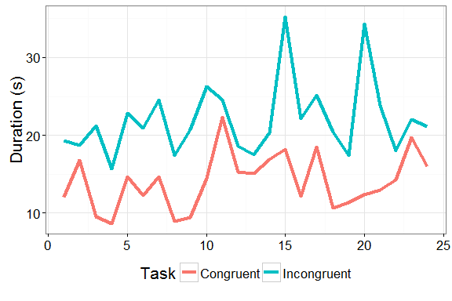
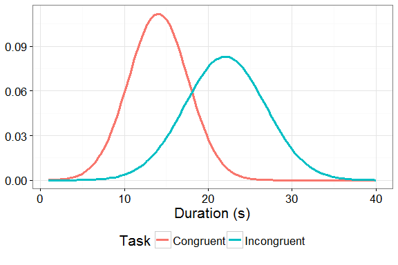

# Stroop Effect
Emilio Gozo  
August 2, 2016  

## Background Information

In a Stroop task, participants are presented with a list of words, with each word displayed in a color of ink. The participant's task is to say out loud the color of the ink in which the word is printed. The task has two conditions: a congruent words condition, and an incongruent words condition. In the congruent words condition, the words being displayed are color words whose names match the colors in which they are printed. In the incongruent words condition, the words displayed are color words whose names do not match the colors in which they are printed. In each case, we measure the time it takes to name the ink colors in equally-sized lists. Each participant will go through and record a time from each condition.

## Variables
In this experiment, the color of the printed words is the independent variable specifically, if it matches what the word says or not. The time it took the participant to say the color is the dependent variable.

## Hypothesis and Testing
It is very interesting to prove that the printed words have strong influence on the ability to say the ink color. This can be done by comparing the result of the congruent task to the incongruent task. For the given sampling data, a paired t-test is appropriate to use. There is a one-to-one correspondence between the two dataset because all participants have done both tasks.

## Dataset

The [dataset](https://www.google.com/url?q=https://drive.google.com/file/d/0B9Yf01UaIbUgQXpYb2NhZ29yX1U/view?usp%3Dsharing&sa=D&ust=1470121605931000&usg=AFQjCNGXGWmDkxvFjhd4PGaEq_Txhec2lw) contains results from a number of participants in the task. Each row of the dataset contains the performance for one participant, with the first number their results on the congruent task and the second number their performance on the incongruent task.

<b>Table. 1 Summary Statistics</b>

type             mean      sd
------------  -------  ------
Congruent      14.051   3.559
Incongruent    22.016   4.797

The summary statistics shown above reveals that the mean and standard deviation of the two samples are different. The line plot shown in Fig. 1 supports this claim and illustrates more clearly how different the datasets are. It is easy to see that all the participants spent longer time finishing the incongruent task compared to the congruent task.

<b>Figure 1. Plot of the dataset</b>

<b>Figure 2. Distribution plot</b>

Assuming normality, the plot above shows the distibution of both sample. Again, we see the how the two are different in terms of spread and magnitude.

## Results

At 0.95 confidence level and critical value of 2.0686576 we reject the null hypothesis that there is no difference between the sample means. Therefore, the printed words have significant effect on saying the color.

### Sources
https://faculty.washington.edu/chudler/words.html#seffect
